# Project introduction

I created this project as a personal challenge to build a weather station, and also as a way to make use of an OpenThread mesh network using EspHome + HomeAssistant.

# Project function

1. Measure ambient temperature, humidity, and atmospheric pressure.

2. Measure the amount and intensity of rainfall.

3. Measure wind speed.

4. Measure wind direction.

# Hardware

I want to fabricate a PCB from the design I created in EasyEDA, which is shown in this program. The design includes the following elements:

1. An ESP32C6 microprocessor from espressif.
2. A lithium battery power system consisting of:
a) A 3.7V single-cell lithium battery 18650
b) A solar panel
c) A lithium battery protection and charging circuit with the components TP4056, DW0A1, and FS8205A
d) A voltage regulator with the TPS63802 circuit
3. A BME280 sensor for measuring temperature, humidity, and atmospheric pressure
4. A DS18B20 sensor for measuring external temperature via a probe
5. A battery monitor with readings on an ESP32C6 GPIO ADC and a voltage divider.
6. Hall effect sensors are used in the rain gauge and the anemometer. Each sensor connects to the ESP32C6 via the analog GPIO pins.
7. AS5600 is 12-bit magnetic position sensor for wind direction

# Software

The ESP32C6 uses Thread technology for data transmission, so I used the EspHome system in conjunction with the open-source HomeAssistant application and an OpenThread Border Router for communication with the internal network.

EspHome enables firmware updates over the Thread network itself, meaning that a device located in a hard-to-reach place can be updated automatically without physical access.

# Other manufacturing

I designed the different elements for measuring rain and wind on the OnShape platform:
- A rain gauge
- An anemometer
- An weathervane (wind direction)

I printed both elements with PETG filament on a 3D printer, and this is the result:

# Image gallery

## Box outdoor and MCU:
Airtight outdoor enclosure with grid for anchoring the PCB, battery and other electronic components.

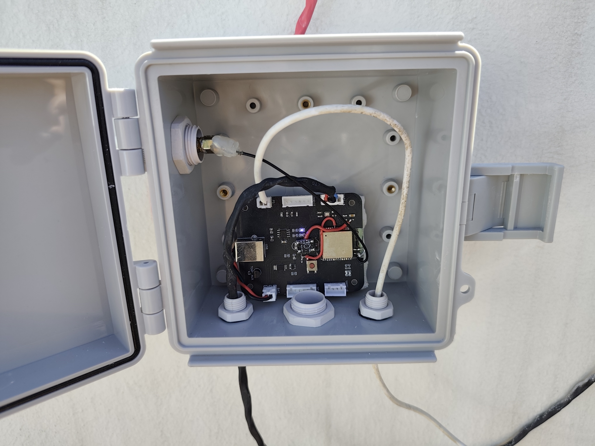

## BME280 Sensor:
The BME280 sensor from Bosch is a tiny device for soldering onto the PCB and records the internal temperature of the case where the MCU is located, as well as humidity and atmospheric pressure.

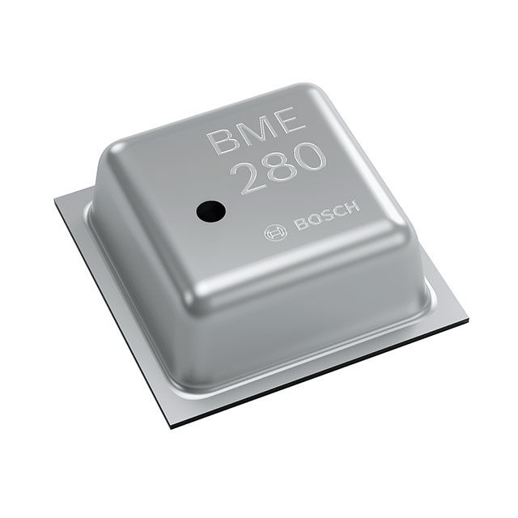

## DS18B20 Sensor:
The DS18B20 is an outdoor temperature sensor; its metal sheath is protected against moisture and dust, and it can measure ambient temperature.

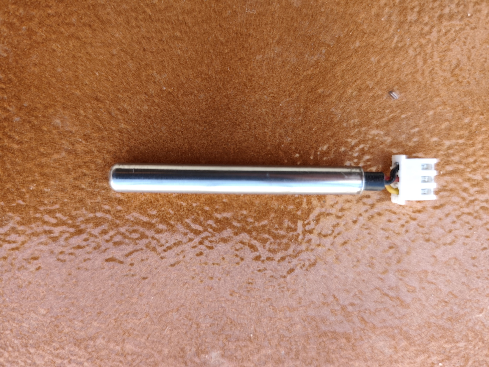

## Rain Gauge:
Rain gauge seen from the outside, you can see the upper area (funnel) where there is a hole that allows water to enter and lead to the tipping bucket.

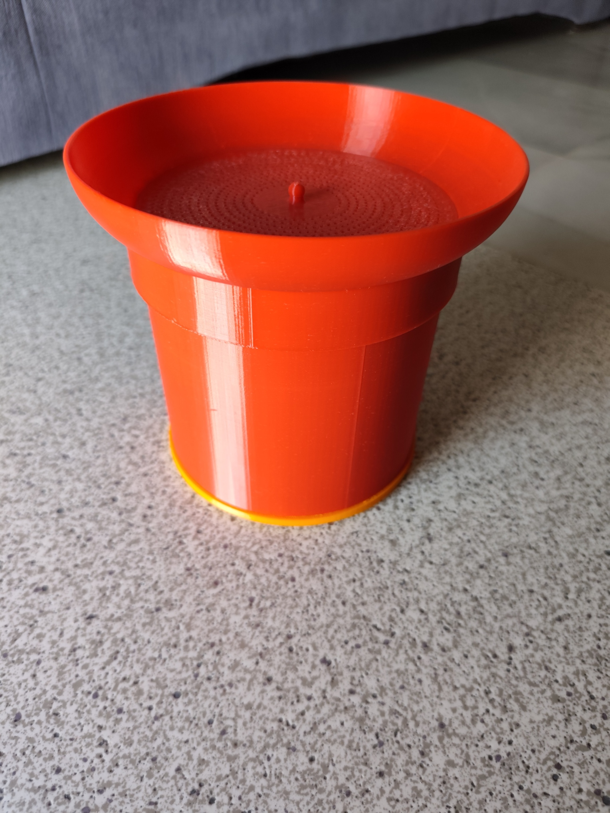

Interior rain gauge: the tipping bucket where the water falls can be seen, and in the front section, the Hall sensor that detects each revolution of the bucket. The neodymium magnet can be seen on the top of the tilting tank (a small metal piece). Using a mathematical formula, the amount of rainfall and intensity can be calculated for each revolution of the bucket, depending on the number of revolutions per minute.

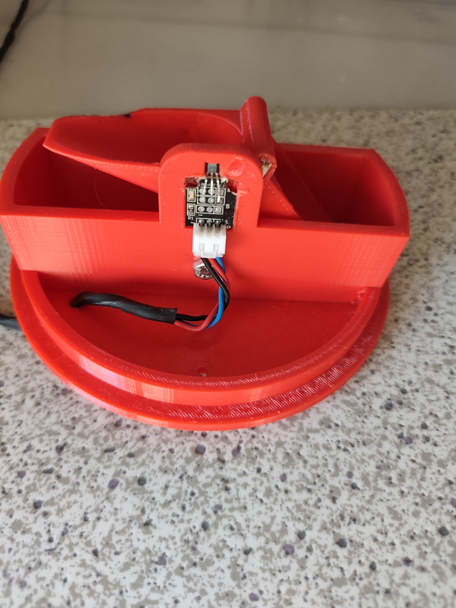

## Anemometer:
This device measures wind speed using a Hall effect sensor connected to its shaft and a neodymium magnet embedded in the rotating housing. Each pulse from the Hall sensor corresponds to one rotation of the device, and wind speed can be calculated using a mathematical formula.

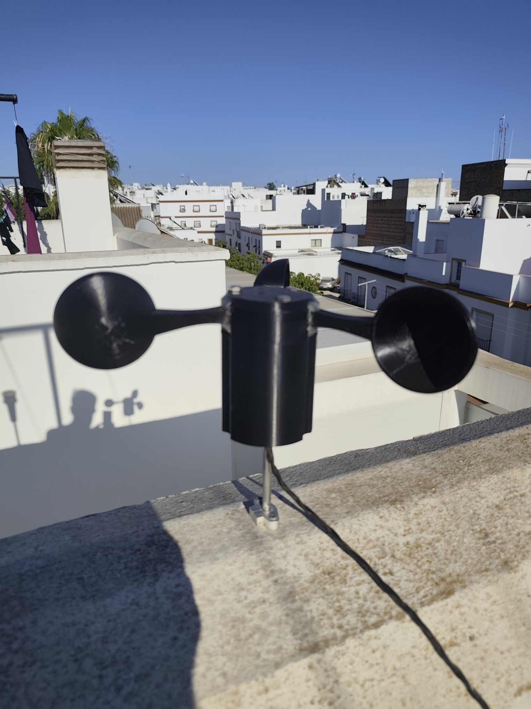

## Weathervane:
Using an AS5600 sensor and a diametrically magnetized magnet. The AS5600 sensor remains fixed on a shaft; a dome containing the magnet at its base, approximately 2-3 mm from the sensor, rotates on this shaft. As the magnet rotates, the sensor can calculate its exact position in degrees and determine the wind direction.

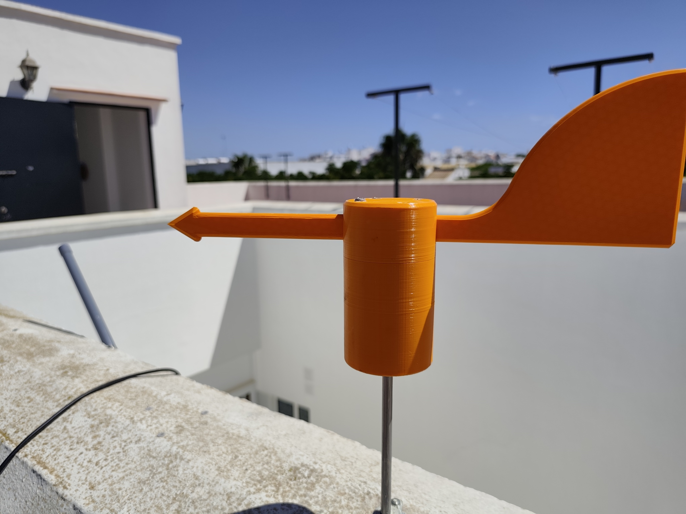

## Solar panel:
Allows the lithium battery to be recharged during daylight hours, and in this way the battery can power the MCU and sensors for many years.

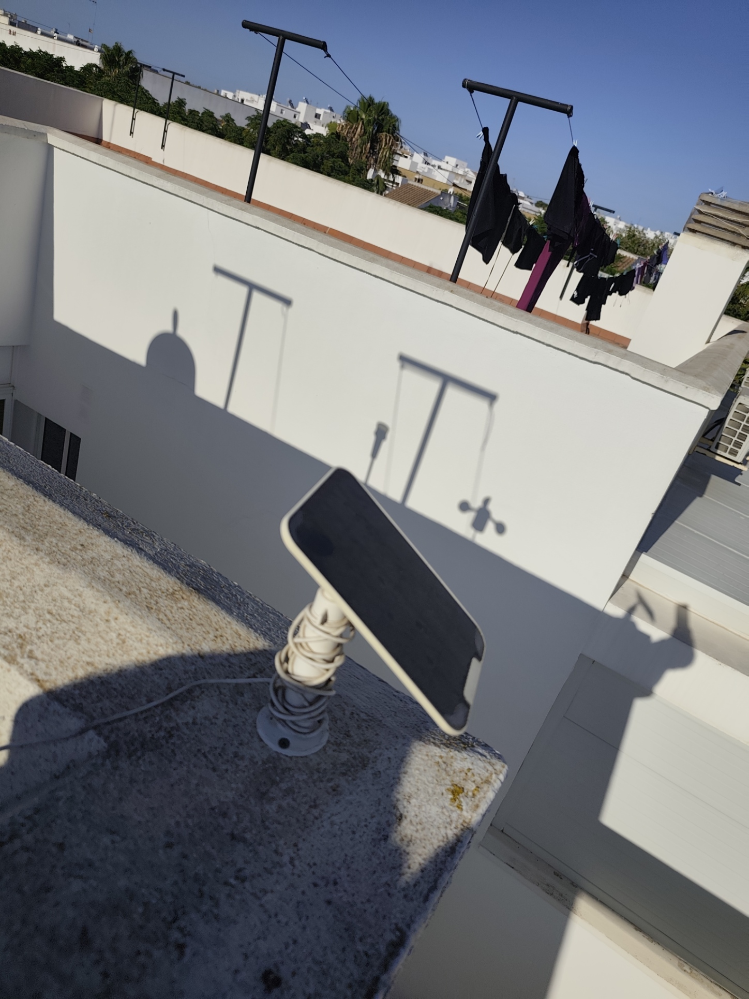

# OnShape Desing:

The rain gauge, anemometer and the weathervane were designed using the OnShape platform, and once designed they were printed on a 3D printer with PETG material.

General Rain Gauge Design:
https://cad.onshape.com/documents/2dcf995cedd97f664920bde0/w/8a44d4fc85dcee91b81b1610/e/77a74460ef746bb4184f5de4?renderMode=0&uiState=6a722d3f2eacb7533533a05f

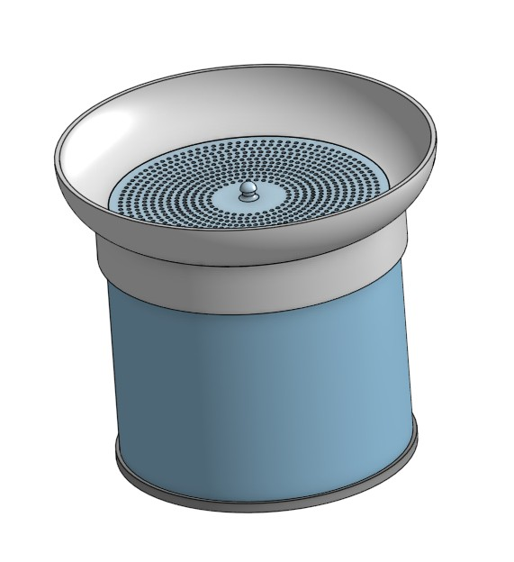

Design of the interior rain gauge (tilting beam):

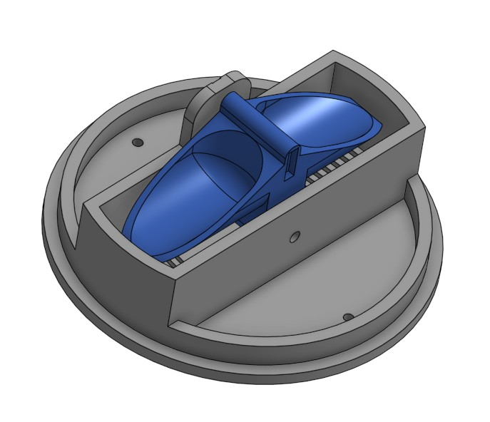

Rain gauge cross-section design:

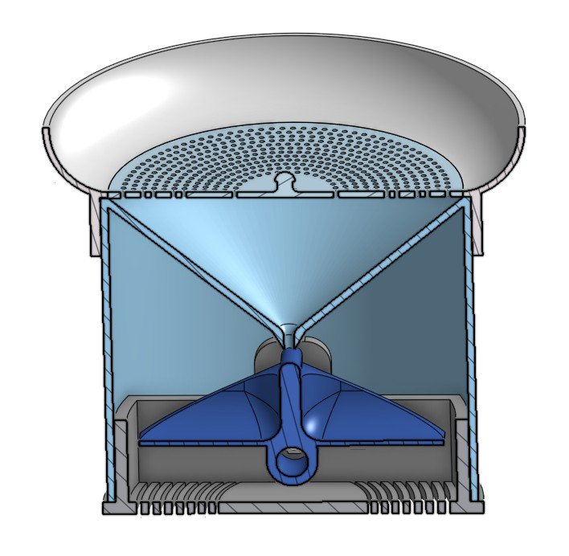

Anemometer design overview:
https://cad.onshape.com/documents/6742c427159a326d2286ed9b/w/4320dd89b1448b79ad4a9c8e/e/1e7c80b05608dad78a0cc4f2?renderMode=0&uiState=6a722d159fd45157bc112ff3

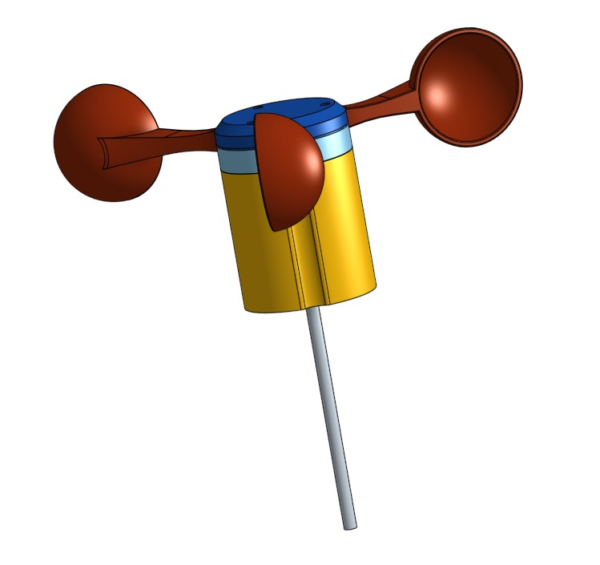

Cross-section design of the anemometer:

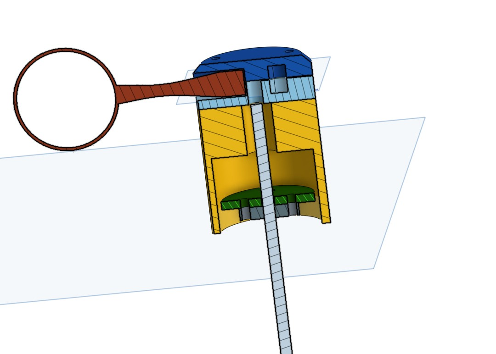

The 3144E is a magnetic hall effect sensor; when a magnet passes near the sensor, it emits an electrical pulse that is recorded in the MCU. Each pulse corresponds to one complete revolution of the anemometer, and therefore, the wind speed can be determined by calculating the number of revolutions the device has made in a given time.

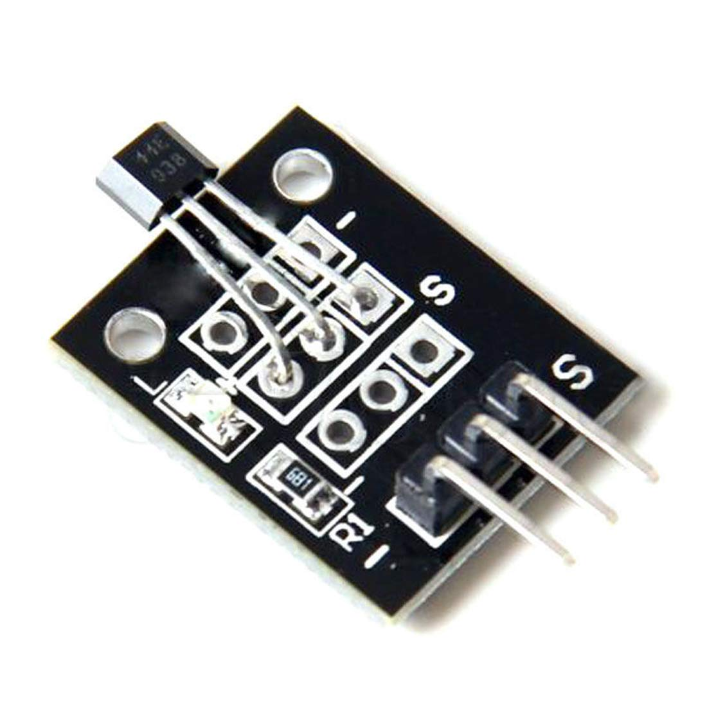

Weathervane design:
https://cad.onshape.com/documents/b86387da9242ebc0d594fa96/w/6a7b8755a9ff353098229fa7/e/60776af953bbda5c55d1507b

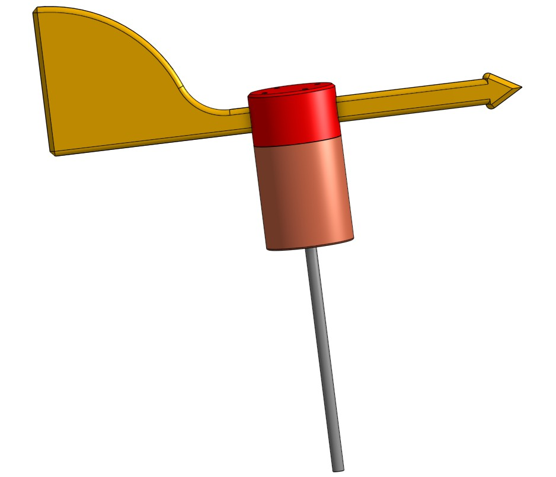

Cross-section design of the weathervane:

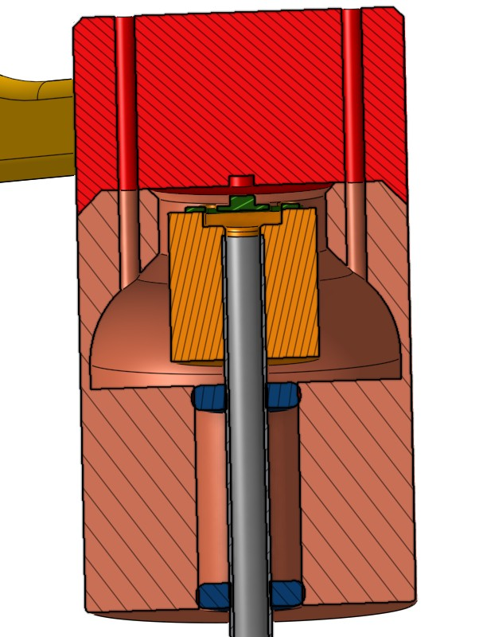

The yellow part that holds the AS5600 board is visible, and the green part above it is the AS5600 sensor.
The dome (red) and the outer cylinder (brown) rotate around the axis (gray) via the bearings (blue).
The round magnet is located at the base of the dome (red), 2 mm from the sensor (green).

AS5600 sensor: for the weathervane is a magnetic position sensor.

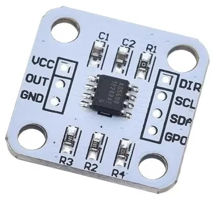
